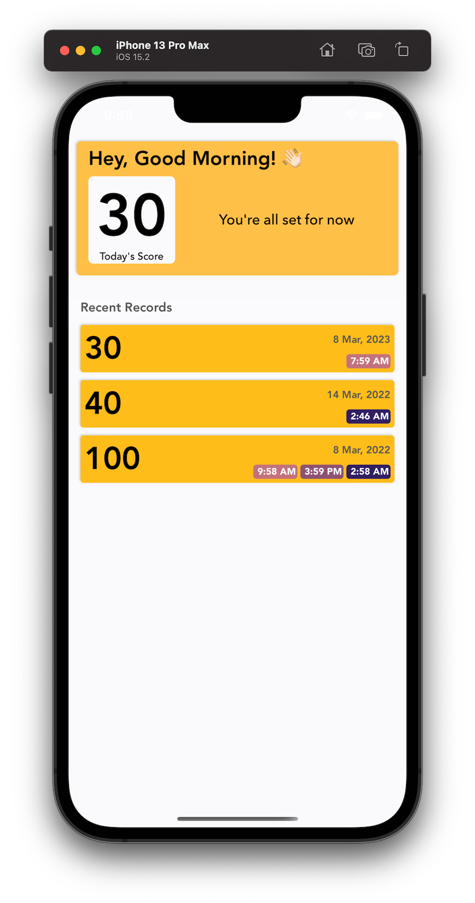

# MedTrack
Simple iOS app written in Swift 5 to track daily medicine use.

## Supports

iOS 15.0+

## Libraries Used

MedTrack use number of open source projects to work properly

* [RxSwift](https://github.com/ReactiveX/RxSwift)
* [RxCocoa](https://github.com/ReactiveX/RxSwift/tree/master/RxCocoa)
* [BRYXBanner](https://github.com/bryx-inc/BRYXBanner)

### Note:
Please do a  `pod install` after checking out.

## ToDo

* Unit Testing

## Contributing
Pull requests are welcome. For major changes, please open an issue first to discuss what you would like to change.

    

